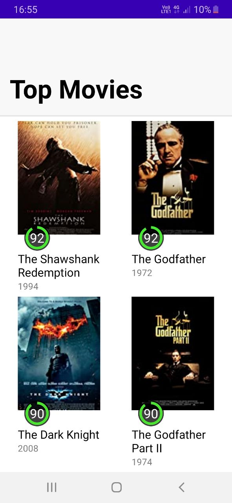
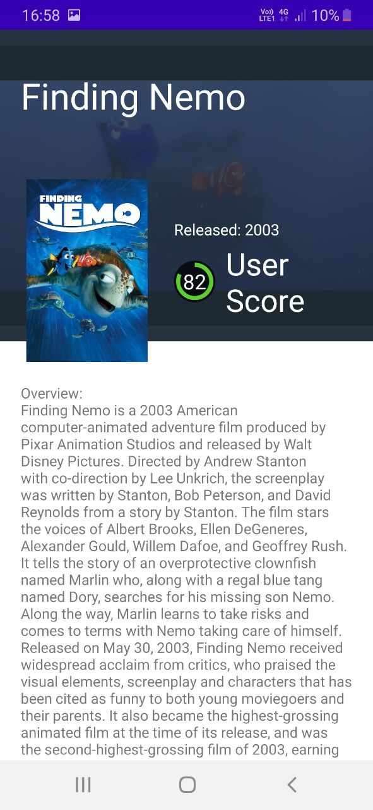

<b>
  

    Скачать: 
    <a href="https://github.com/GrishaninVyacheslav/movies-pagination/releases/download/pre-release/movies_pagination.apk">movies_pagination.apk</a>
  

  

    Стек технологий: Retrofit, Kotlin Coroutines, Koin, ViewModel, Fragments.
  

  

    Навигация между экранами: Cicerone.
  

</b>
Пример приложения, использующего Jetpack Paging 3. Состоит из основанного экрана в виде списка популярных фильмов и дополнительного экрана с описанием выбранного фильма. Для получения информации о фильмах используется IMDb API. Приложение реализует архитектуру MVVM с соблюдением принципов SOLID, Clean Architecture, Single Activity.

  
  

